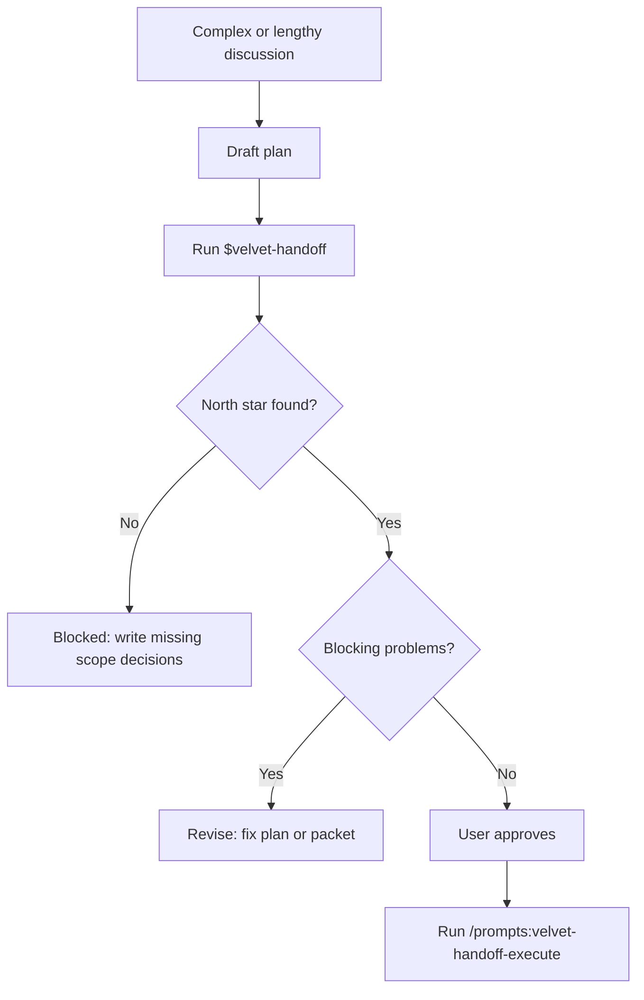

# Velvet Handoff

Velvet Handoff is a Codex skill for the last serious audit before an agent starts implementation.

Use it after a long or messy discussion, when the plan sounds clear in chat but may not be grounded in the repo yet.

It does three things:

1. Reports source coverage, including whether relevant chat history is visible.
2. Finds the north star: scope files in the repo plus agreed chat decisions that are not written down yet.
3. Audits the handoff against the repo, tooling, contracts, failure modes, and validation plan.
4. Returns a structured report sorted by importance. Every problem must include evidence and a realistic fix.

No motivational filler. No abstract frameworks. No "consider improving X" without saying exactly where, why, and how.

## Flow



## What It Must Check

| Check | What it means |
| --- | --- |
| Source coverage | State whether repo files, handoff packet, and chat history are visible. If chat is missing for a chat-dependent audit, mark the audit incomplete. |
| North star | Find repo files that define scope, architecture, decisions, data contracts, UI contracts, or validation. Also extract visible chat decisions that are not materialized in files. |
| Scope drift | Compare the draft plan against accepted decisions, rejected decisions, excluded scope, and open decisions. |
| Repo fit | Check whether the plan matches current code paths, current files, tests, schemas, commands, and existing conventions. |
| Tool fit | Check whether the selected tools are real, available, efficient enough, and have failure handling. |
| Contracts | Check inputs, outputs, storage, UI states, errors, recovery, evidence, verdicts, and stop conditions. |
| Execution shape | Check whether the implementation needs segments, approvals, or kill points before the next agent touches code. |

## Report Rules

Every reported problem must include:

- severity: `P0`, `P1`, `P2`, or `P3`
- evidence: repo file with line when available, command output, visible chat decision, or named missing artifact
- why it matters
- concrete fix
- where the fix belongs
- validation check

Sort problems by severity. If a problem has no realistic fix, it is not ready to report.

## Hard Guardrails

- Do not invent a north star. If no source-of-truth file exists, say that is the blocker.
- Do not treat chat as implemented until a repo file or packet reflects it.
- Do not reconstruct missing chat context. Ask for the excerpt, packet, or plan.
- Do not hide missing chat context. If chat is not visible, mark the audit repo-only or incomplete.
- Do not give generic advice like "improve error handling" without naming the exact failure, surface, and recovery.
- Do not approve implementation when open decisions are blocking.
- Do not approve implementation when validation is vague.
- Do not start implementation from loose chat memory.
- Do not produce a long report when five sharp findings are enough.
- If independent audit agents are used, use the strongest available reasoning model and keep the agent count small.

## Packet Gate

Implementation can start only when the handoff packet says `Ready For Implementation`, source coverage is sufficient, open decisions are empty or non-blocking, and the user approves moving forward.

Required packet sections are defined in `velvet-handoff/references/handoff-template.md`.

## Entry Points

| Entry point | What it does |
| --- | --- |
| `$velvet-handoff` | Runs the pre-handoff audit and creates or updates the implementation packet. |
| `/prompts:velvet-handoff-execute` | Starts implementation from an approved ready packet. |

## Install

Copy the inner `velvet-handoff/` folder into:

```text
~/.codex/skills/velvet-handoff/
```

Optional slash prompts live in `prompts/`. Custom prompts are local Codex files, not repo-loaded commands. Copy the Markdown files directly into:

```text
~/.codex/prompts/
```

Then restart Codex or open a new chat so the commands load. Codex scans only top-level Markdown files in that folder.

Use it with:

```text
Use $velvet-handoff on this plan before implementation.
/prompts:velvet-handoff
/prompts:velvet-handoff-execute docs/planning/my-feature-implementation-handoff.md
```

If `/prompts:velvet-handoff-execute` does not appear in your Codex surface, use `$velvet-handoff` and ask it to execute from the ready handoff packet. The skill is the supported durable workflow; the slash prompt is only a convenience wrapper.
