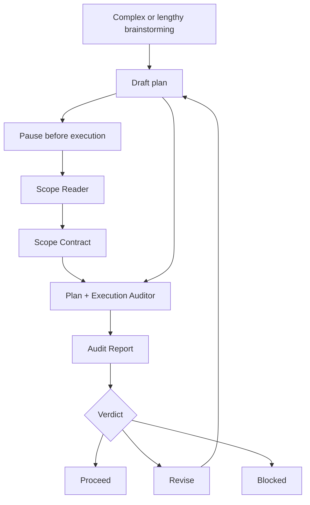

# Velvet Handoff

Velvet Handoff is a lightweight Codex skill for auditing plans before execution.

It is for complex, lengthy, expensive, ambiguous, mutating, or high-blast-radius work. It is not a planning framework and not a substitute for shipping.

**Five minutes before execution beats five hours of cleanup.**

## Flow



## What It Checks

| Gate | Question |
| --- | --- |
| Scope Gate | Did we understand what the user actually wants? |
| Plan Gate | Does the plan satisfy the scope without omissions or scope creep? |
| Execution Gate | Will the plan survive contact with code, tools, cost, tests, and failure modes? |
| Handoff Format Gate | Is the plan shaped so Codex or another agent can execute it correctly? |

## Modes

| Mode | Use When |
| --- | --- |
| `quick` | Normal risky task |
| `standard` | Multi-step coding, analysis, or product work |
| `full` | Expensive, mutating, architecture-level, or unclear work |
| `handoff` | You want an execution brief for Codex or another agent |

Default to `quick`. Escalate only when risk justifies it.

## Install

Copy the `velvet-handoff` folder into your Codex skills directory:

```text
~/.codex/skills/velvet-handoff
```

Then invoke it with:

```text
Use $velvet-handoff to audit this plan before execution.
```

## Skill ID

The public name is **Velvet Handoff**.

The Codex skill id is `velvet-handoff` because Codex skill names use hyphen-case.
