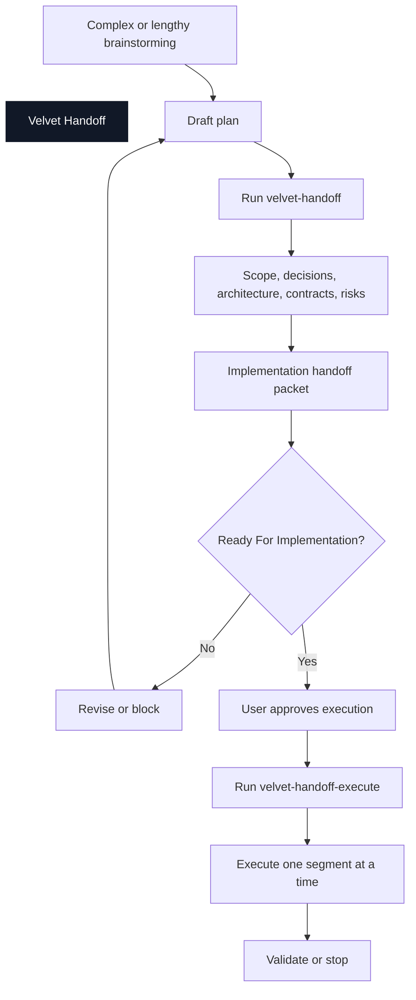

# Velvet Handoff

Velvet Handoff is a Codex skill for turning messy, high-stakes planning into a clean implementation handoff.

It is for complex, lengthy, expensive, ambiguous, mutating, or high-blast-radius work. It is not a planning framework and not a substitute for shipping.

**Five minutes before execution beats five hours of cleanup.**

## Flow



## What It Checks

| Gate | Question |
| --- | --- |
| Scope Gate | Did we understand what the user actually wants? |
| Plan Gate | Does the plan satisfy the scope without omissions or scope creep? |
| Execution Gate | Will the plan survive contact with code, tools, cost, tests, and failure modes? |
| Handoff Format Gate | Is the plan shaped so Codex or another agent can execute it correctly? |

## The Packet

The handoff packet is the source of truth before implementation starts.

It should contain:

- objective
- included and excluded scope
- accepted decisions
- rejected decisions
- open decisions
- architecture
- tool and data contracts
- UI contracts
- error and recovery contracts
- evidence and verdict contracts
- implementation segments
- stop conditions
- validation plan
- known risks
- implementation start checklist

Implementation can start only when the packet says `Ready For Implementation`, open decisions are empty or non-blocking, and the user approves moving forward.

## Two Invocations

| Invocation | What it does | What it must not do |
| --- | --- | --- |
| `velvet-handoff` | Audits the plan and creates or updates the packet | Start implementation |
| `velvet-handoff-execute` | Executes from an approved ready packet | Improvise from loose chat memory |

`velvet-handoff-execute` is the handoff trigger, not a second planning mode.

## What It Will Not Do

- It will not audit simple tasks unless you ask.
- It will not create long reports by default.
- It will not block execution over cosmetic issues.
- It will not call independent agents unless the risk justifies the review cost.
- It will not start implementation without a ready packet and explicit approval.

## Install

Copy the inner `velvet-handoff/` folder that contains `SKILL.md` into your Codex skills directory.

The final path should be:

```text
~/.codex/skills/velvet-handoff/SKILL.md
```

Then invoke it with:

```text
Use $velvet-handoff to audit this plan before execution.
```

## Optional Slash Commands

Codex skills are the recommended path. Treat these custom prompts as optional wrappers for people who prefer commands.

Copy the files in `prompts/` into:

```text
~/.codex/prompts/
```

Then use:

```text
/prompts:velvet-handoff
/prompts:velvet-handoff-execute docs/planning/my-feature-implementation-handoff.md
```

The slash commands only call the skill with a stricter prompt. The skill remains the real logic.

## Skill ID

The public name is **Velvet Handoff**.

The Codex skill id is `velvet-handoff` because Codex skill names use hyphen-case.
